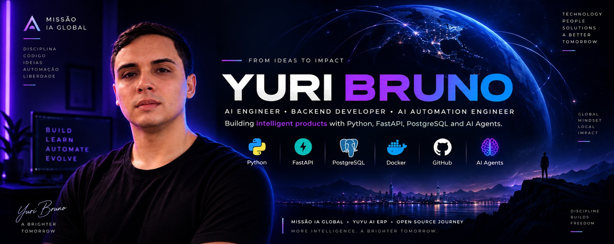

# 👋 Hi, I'm Yuri Bruno

### AI Automation Developer • Backend Developer (Python) • Building in Public

🇧🇷 Natal, Rio Grande do Norte — Brazil • 🌍 Open to Remote Opportunities

🇺🇸 [English](README.md) · 🇧🇷 [Português](README.pt-BR.md) · 🇪🇸 [Español](README.es.md) · 🇫🇷 [Français](README.fr.md) · 🇮🇹 [Italiano](README.it.md)

---

Soy un desarrollador brasileño en transición hacia **AI Engineering**,
construyendo software real, probado en producción, en lugar de acumular
tutoriales — y documentando todo el proceso en público a través de
**Missão IA Global**.

## 🧭 Sobre mí

Vengo de un historial en soporte de TI y operaciones digitales (Aptek
Tecnologia, Grupo Services, Beltrasi Renz) y tengo un título técnico en
Informática. Ahora estoy enfocado en convertirme en **AI Automation
Developer / Backend Developer**, aprendiendo entregando un proyecto real
a la vez en lugar de acumular certificados.

Cada hito de abajo es código que funciona, se prueba de punta a punta, y
se despliega — no es solo un plan.

📚 Mis primeros pasos en Python (fundamentos, scripts de terminal) están
documentados en mi cuenta anterior:
[github.com/ybss84](https://github.com/ybss84)

## 🚀 Proyecto destacado — Clasificador de Feedback con IA

Una API en producción que clasifica el feedback de clientes y decide por
sí misma cuándo un caso necesita un humano.

- 🧠 Clasifica el sentimiento (positivo / negativo / neutro) con justificación, usando la **API de Gemini**.
- ✍️ Sugiere una respuesta lista para enviar al cliente.
- 🤖 Un **agente de IA** real — no una regla fija tipo `if` — decide vía **function calling** si un caso necesita seguimiento humano, escribiendo su propio motivo cuando decide actuar.
- 🔎 El agente puede consultar casos similares antes de decidir, para detectar problemas recurrentes.
- 🗄️ **PostgreSQL** en producción (migrado desde SQLite para que el historial sobreviva a los redeploys).
- 🐳 **Dockerizado** — API + Postgres vía `docker-compose`, un solo comando para ejecutar localmente.
- ☁️ Desplegado en **Render**, infraestructura como código vía `render.yaml`.

🔗 **Documentación de la API en vivo:** [missao-ia-global-classificador.onrender.com/docs](https://missao-ia-global-classificador.onrender.com/docs)
📂 **Código:** [github.com/yuribrunoss/missao-ia-global](https://github.com/yuribrunoss/missao-ia-global)

## 🗺️ Missão IA Global — Roadmap

Mi roadmap de aprendizaje, un volumen a la vez — cada uno entregado como
código real y probado antes de pasar al siguiente:

| Volumen | Enfoque | Estado |
| --- | --- | --- |
| 1 — Python for AI | Primer CLI con la API de Gemini | ✅ Concluido |
| 2 — Automatización | Lógica de decisión + acción | ✅ Concluido |
| 3 — AI Agents | Function calling + memoria | ✅ Concluido |
| 4 — Backend AI | PostgreSQL + Docker, en producción | ✅ Concluido |
| YUYU AI ERP | Future Hero Project — no iniciado | 🔜 Siguiente |

## 🛠️ Stack Tecnológico — con lo que realmente he construido

**Backend:** Python · FastAPI · PostgreSQL · SQLite
**IA:** API de Google Gemini (con function calling / agentes de IA)
**Infra y Herramientas:** Docker · Git & GitHub · VS Code · uv

**Aprendiendo ahora:** GitHub Actions (CI/CD) · pruebas con Pytest · inglés (práctica diaria)

## 📊 Estadísticas de GitHub

## 🌎 Conecta conmigo

- 💻 GitHub — [@yuribrunoss](https://github.com/yuribrunoss)
- 🔗 LinkedIn — Yuri Bruno
- 📍 Natal, RN — Brasil · abierto a puestos remotos (Brasil, Europa, Norteamérica)

> Construyendo un proyecto real a la vez — documentado, probado y publicado en público.
